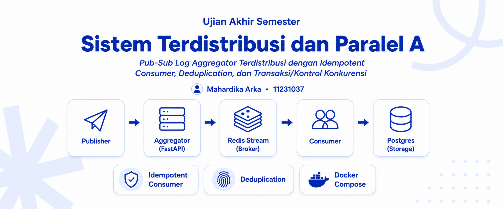
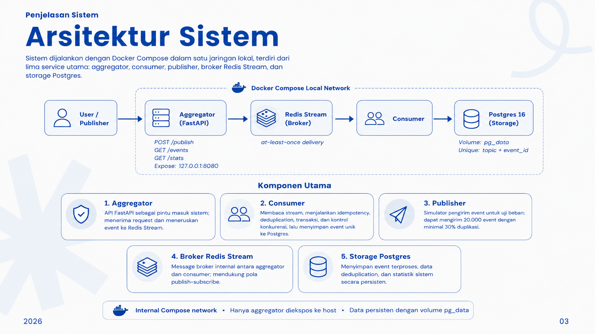

<p align="center">
  
</p>

<h1 align="center">UAS &middot; Pub-Sub Log Aggregator</h1>

<p align="center">
  <em>Distributed Pub-Sub Log Aggregator with Idempotent Consumer,<br>
  Persistent Deduplication, Transactions, and Concurrency Control</em>
</p>

<p align="center">
  
  
  
  
  
  
</p>

<p align="center">
  
  
  
  
</p>

---

## &#128100; Identitas

> *Ujian Akhir Semester &mdash; **Sistem Terdistribusi dan Paralel A***

| Keterangan | Detail |
| :--- | :--- |
| **Mata Kuliah** | Sistem Terdistribusi dan Paralel A |
| **Nama** | Mahardika Arka |
| **NIM** | `11231037` |
| **Tema** | *Pub-Sub Log Aggregator Terdistribusi* |

---

## &#127909; Demo Video

> *Walkthrough lengkap arsitektur, idempotency, dan demo Swagger dalam satu video.*

<p align="center">
  <a href="https://youtu.be/PLACEHOLDER">
    
  </a>
</p>

```text
YouTube: https://youtu.be/PLACEHOLDER   (link menyusul)
```

---

## &#128221; Ringkasan

Project ini membangun sistem **Pub-Sub Log Aggregator** berbasis multi-service
Docker Compose. Sistem menerima event log dari publisher, memasukkan event ke
broker internal, lalu memproses event secara *idempotent* melalui consumer.

*Fokus utama implementasi:*

- **Idempotent consumer**: event yang sama tidak diproses ulang.
- **Persistent deduplication**: dedup store disimpan di PostgreSQL.
- **Transactions and concurrency control**: pemrosesan event memakai transaksi,
  unique constraint, dan atomic upsert.
- **At-least-once delivery**: duplicate delivery ditoleransi tanpa membuat data
  ganda.
- **Local Compose network**: Redis dan PostgreSQL tetap internal, hanya API yang
  diekspos ke host.

---

## &#127959; Arsitektur Sistem

<p align="center">
  
</p>

*Alur utama sistem:*

```text
Publisher / Swagger
        |
        v
Aggregator API (FastAPI)
        |
        v
Redis Stream (Broker)
        |
        v
Consumer Workers
        |
        v
PostgreSQL (Events, Dedup Store, Stats)
```

### Service Compose

| Service | Teknologi | Peran |
| --- | --- | --- |
| `aggregator` | FastAPI + Uvicorn | API utama untuk publish event, melihat event, stats, dan Swagger demo. |
| `consumer` | Python async worker | Membaca Redis Stream dan memproses event ke PostgreSQL. |
| `publisher` | Python + HTTPX | Simulator pengirim 20.000 event dengan minimal 30% duplikasi. |
| `broker` | Redis 7 Alpine | Message broker internal menggunakan Redis Stream dan consumer group. |
| `storage` | PostgreSQL 16 Alpine | Penyimpanan persisten untuk event, dedup store, dan statistik. |

Semua service berjalan di network lokal Compose `pubsub_net`. Hanya
`aggregator` yang diekspos ke host melalui port `8080`; Redis dan PostgreSQL
tetap internal.

---

## &#128230; Model Event

Event minimal memiliki struktur berikut:

```json
{
  "topic": "payment",
  "event_id": "payment-123",
  "timestamp": "2026-06-16T10:00:00Z",
  "source": "publisher-simulator",
  "payload": {
    "message": "example log"
  }
}
```

Pasangan `topic` dan `event_id` menjadi identitas unik event untuk proses
deduplication.

---

## &#128225; API Endpoint

| Method | Endpoint | Fungsi |
| --- | --- | --- |
| `GET` | `/health` | Mengecek koneksi API, PostgreSQL, dan Redis. |
| `POST` | `/publish` | Menerima single event atau batch event. |
| `GET` | `/events?topic=...` | Menampilkan event unik yang sudah diproses. |
| `GET` | `/stats` | Menampilkan statistik global sistem. |
| `POST` | `/demo/publish-single` | Demo publish satu event. |
| `POST` | `/demo/publish-duplicate` | Demo duplicate event dan idempotency. |
| `POST` | `/demo/publish-batch` | Demo batch event dan performa 20.000 event. |
| `POST` | `/demo/concurrency` | Demo request paralel untuk uji race condition. |

Swagger UI tersedia di:

```text
http://127.0.0.1:8080/docs
```

Gunakan `127.0.0.1`, bukan `localhost`, bila Swagger `Execute` menampilkan
`Failed to fetch` pada Windows.

---

## &#128260; Idempotency dan Deduplication

Deduplication dilakukan secara persisten menggunakan tabel `processed_events`
di PostgreSQL.

```sql
UNIQUE (topic, event_id)
```

Saat consumer memproses event, sistem menjalankan query berikut di dalam
transaksi:

```sql
INSERT INTO processed_events (topic, event_id)
VALUES ($1, $2)
ON CONFLICT (topic, event_id) DO NOTHING
RETURNING id;
```

Jika query mengembalikan `id`, event dianggap baru dan disimpan ke tabel
`events`. Jika tidak ada `id`, event dianggap duplikat dan dihitung sebagai
`duplicate_dropped`.

Dengan pola ini, correctness deduplication dijamin oleh database, bukan hanya
oleh pengecekan aplikasi.

---

## &#9881; Transaksi dan Kontrol Konkurensi

Setiap batch event diproses di dalam transaksi PostgreSQL dengan isolation
level:

```text
READ COMMITTED
```

Race condition dicegah melalui:

- transaksi database,
- unique constraint `(topic, event_id)`,
- atomic upsert `ON CONFLICT DO NOTHING`,
- update statistik dengan SQL increment.

Walaupun banyak worker memproses event yang sama secara paralel, hanya satu
insert dedup yang akan berhasil. Worker lainnya akan mengenali event sebagai
duplicate.

---

## &#128640; Menjalankan Sistem

Build dan jalankan seluruh service:

```powershell
docker compose up -d --build
```

Cek status container:

```powershell
docker compose ps
```

Cek health API, database, dan broker:

```powershell
curl http://127.0.0.1:8080/health
```

Response yang diharapkan:

```json
{
  "status": "ok",
  "database": "ok",
  "broker": "ok"
}
```

Turunkan semua service tanpa menghapus volume:

```powershell
docker compose down
```

---

## &#129514; Demo Melalui Swagger

Buka:

```text
http://127.0.0.1:8080/docs
```

Gunakan endpoint pada tag **Demo Use Cases**:

| Demo | Endpoint | Hasil yang Diharapkan |
| --- | --- | --- |
| Single event | `/demo/publish-single` | `received=1`, `unique_processed=1`, `duplicate_dropped=0` |
| Duplicate event | `/demo/publish-duplicate?copies=5` | `received=5`, `unique_processed=1`, `duplicate_dropped=4` |
| Batch 20.000 event | `/demo/publish-batch?total=20000&duplicate_rate=0.30` | Sekitar `14000` unique dan `6000` duplicate |
| Concurrency | `/demo/concurrency?requests=50` | `unique_processed=1`, sisanya duplicate |

Setiap response demo menyertakan `result` dan `stats`, sehingga cocok untuk
presentasi video tanpa harus berpindah ke banyak terminal.

---

## &#128226; Publisher Simulator

Publisher simulator mengirim 20.000 event dengan 30% duplikasi.

```powershell
docker compose --profile tools run --rm publisher
```

Default konfigurasi:

| Variabel | Nilai |
| --- | --- |
| `TOTAL_EVENTS` | `20000` |
| `DUPLICATE_RATE` | `0.30` |
| `BATCH_SIZE` | `250` |

Contoh override:

```powershell
docker compose --profile tools run --rm `
  -e TOTAL_EVENTS=5000 `
  -e DUPLICATE_RATE=0.40 `
  -e BATCH_SIZE=100 `
  publisher
```

---

## &#128190; Persistensi Data

PostgreSQL menggunakan named volume:

```yaml
volumes:
  pg_data:
```

Demo persistensi:

```powershell
curl http://127.0.0.1:8080/stats
docker compose down
docker compose up -d
curl http://127.0.0.1:8080/health
curl http://127.0.0.1:8080/stats
```

Data tetap ada selama volume `pg_data` tidak dihapus. Jangan gunakan
`docker compose down -v` jika ingin mempertahankan data demo.

---

## &#9989; Menjalankan Tests

Install dependencies:

```powershell
pip install -r aggregator/requirements.txt -r publisher/requirements.txt -r tests/requirements.txt
```

Jalankan test di Windows PowerShell:

```powershell
$env:PYTHONPATH = "aggregator;publisher"
pytest tests
```

Jumlah test saat ini:

```text
20 tests
```

Cakupan test:

- validasi schema event,
- single dan batch publish,
- duplicate event,
- stats dan daftar topic,
- endpoint demo Swagger,
- schema dedup unique constraint,
- publisher simulator,
- chunking batch.

---

## &#128203; Bukti Requirement

| Requirement | Implementasi |
| --- | --- |
| Multi-service Docker Compose | `aggregator`, `consumer`, `publisher`, `broker`, `storage` |
| Message broker internal | Redis Stream |
| Storage persisten | PostgreSQL dengan named volume `pg_data` |
| Idempotent consumer | Dedup berdasarkan `(topic, event_id)` |
| Dedup persisten | Tabel `processed_events` dengan unique constraint |
| Transaksi | `connection.transaction(isolation="read_committed")` |
| Kontrol konkurensi | `INSERT ... ON CONFLICT DO NOTHING RETURNING id` |
| Observability | `/health`, `/events`, `/stats`, logging consumer |
| Performa minimum | Demo batch 20.000 event dengan 30% duplikasi |
| Tests | 20 automated tests |

---

## &#128193; Struktur Project

```text
.
|-- aggregator/
|   |-- Dockerfile
|   |-- requirements.txt
|   `-- aggregator_app/
|       |-- main.py
|       |-- consumer.py
|       |-- repository.py
|       |-- database.py
|       |-- broker.py
|       |-- models.py
|       `-- settings.py
|-- publisher/
|   |-- Dockerfile
|   |-- requirements.txt
|   `-- publisher_app/
|       `-- publisher.py
|-- scripts/
|   `-- concurrency_demo.py
|-- tests/
|-- images/
|   |-- header.png
|   `-- aristektur.png
|-- docker-compose.yml
|-- README.md
`-- report.md
```

---

## &#128221; Catatan Laporan

*Keputusan desain utama yang perlu disorot pada laporan dan video:*

- delivery diasumsikan **at-least-once**,
- Redis Stream menjadi broker Pub-Sub internal,
- deduplication dijamin oleh PostgreSQL,
- isolation level yang digunakan adalah `READ COMMITTED`,
- sistem tidak menjanjikan total ordering global,
- ordering praktis memakai `timestamp` dan `processed_at`,
- data persisten selama named volume tidak dihapus.

---

## &#128279; Repository

<p align="center">
  <a href="https://github.com/spirinity/uas-sister">
    
  </a>
</p>

```text
https://github.com/spirinity/uas-sister
```

---

<p align="center">
  <em>Dibuat oleh <strong>Mahardika Arka</strong> &middot; NIM <code>11231037</code></em><br>
  <sub><em>Sistem Terdistribusi dan Paralel A</em></sub>
</p>
